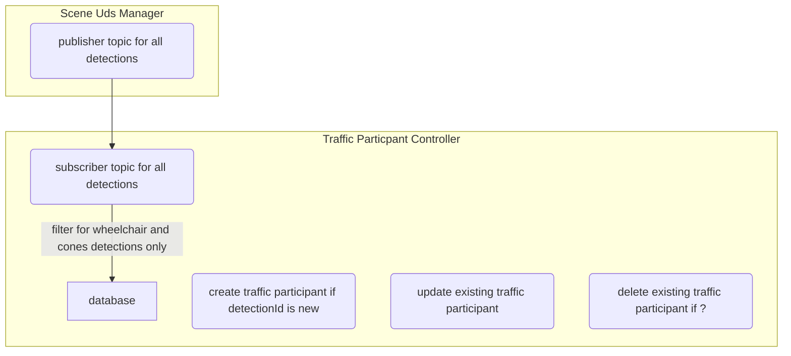

# traffic_participant_controller

api for create update and delete of traffic participant. specifically from scene understanding manager with wheelchair and cone detection only. 

```mermaid
graph TB

  Publisher --> Subscriber
  subgraph "Scene Uds Manager"
  Publisher(publisher topic for all detections)
  end

  subgraph "Traffic Particpant Controller"
  Subscriber(subscriber topic for all detections)
  Subscriber -- filter for wheelchair and cones detections only --> database
  Create(create traffic participant if detectionId is new)
  Update(update existing traffic participant)
  Delete(delete existing traffic participant if ?)

end
```
