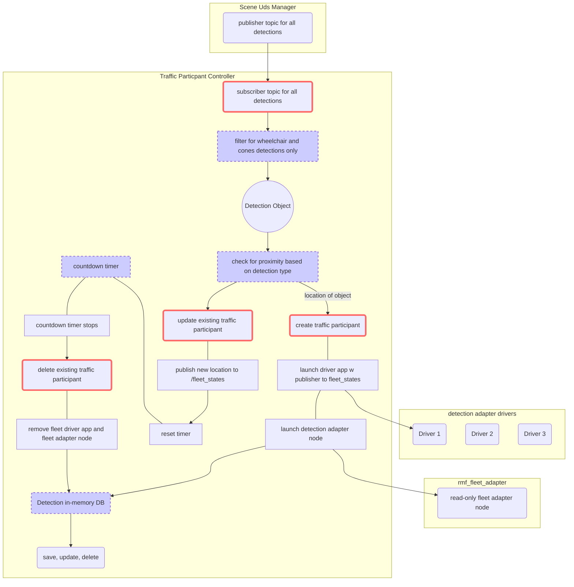

# traffic_participant_controller

api for create update and delete of traffic participant. specifically from scene understanding manager with wheelchair and cone detection only. 

design reference to confluence page(https://imda-dsl.atlassian.net/wiki/spaces/VAMA/pages/470286350/Alternate+flow+for+lift+integration+and+obstacle)

## components details

- adapter driver: similar to fleet adapater drivers where its job is to transmit `rmf_fleet_msgs/FleetState` messages out to the `fleet_states` topic. It is a ROS 2 application (using either rclcpp or rclpy) which we will refer to as the Fleet Driver.

## software design

1. Proximity checker 
- for wheelchair (dynamic object): 2m x width of traffic lane
- for cones (static object): 0.5m x width of traffic lane

2. Countdown Timer to check if existing traffic participant exceed a time threshold. This may need multi-threading. 
- Each thread created for a new traffic participant and start counting down. Once countdown is up, traffic particpant would be deleted. 
- If existing participant gets updated, countdown should reset. 

## test scenario

1. static images 

- location of these detection would change according to the current location of robot as camera location is at a relative location. 

## TODO:

1. how to run launch.xml file using ROS python library? to launch fleet adapter node in rmf_fleet_adapter package.

## follow-up

1. `detection_states` topic be created that is integrated with `rmf_traffic`. detection traffic participants are riding on `fleet_states` topic since `rmf_fleet_adapter` library is utilised. 

